# Procesverslag
Markdown is een simpele manier om HTML te schrijven.  
Markdown cheat cheet: [Hulp bij het schrijven van Markdown](https://github.com/adam-p/markdown-here/wiki/Markdown-Cheatsheet).

Nb. De standaardstructuur en de spartaanse opmaak van de README.md zijn helemaal prima. Het gaat om de inhoud van je procesverslag. Besteedt de tijd voor pracht en praal aan je website.

Nb. Door *open* toe te voegen aan een *details* element kun je deze standaard open zetten. Fijn om dat steeds voor de relevante stuk(ken) te doen.

## Jij

  
uitwerken voor kick-off werkgroep

  ### Auteur:
  dylan thai

  #### Je startniveau:
  blauw-rood

  #### Je focus:
  responsive (kies uit responsive óf surface plane)

## Je website

  
uitwerken voor kick-off werkgroep

  ### Je opdracht:
  amazing oriental https://amazingoriental.com/
  

  #### Screenshot(s) van de eerste pagina (small screen): 
  homepagina van de amazing oriental nederland 
  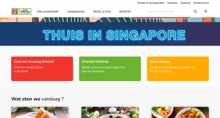
  

  #### Screenshot(s) van de tweede pagina (small screen):
  recept pagina van yaki onigiri amazing oriental nederland 
  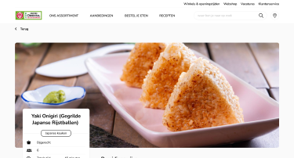
  

## Toegankelijkheidstest 1/2 (week 1)

  
uitwerken na test in 2e werkgroep

  ### Bevindingen
  Lijst met je bevindingen die in de test naar voren kwamen:
  Homepage van oriental heeft een span in de html van 'vandaag ?' deze komt talloos keer vol in de heading list van de accesibility narrator. Meeste links zijn wel kloppend op 1 button na, sommige links lijken meer op een section & de volgorde van hiërarchie eerst 'bekijk dit artikel' dan pas het 'product'. Ook is in deze lijst geen hiërarchie en h1 is niet te vinden maar staat wel in de html.
  De website is via wordpress opgezet waardoor niet alles semantisch is in de html.
  De recept-yaki-onigiri heeft wel een hiërarchie van h-tags.
  Bijna alle afbeeldingen beide pagina's hebben geen src alt text.
  De shift-tab knop werkt niet helemaal zonder narrator? Je ziet links onder wel de url, maar geen outline waar je nu bevindt met narrator wel.
  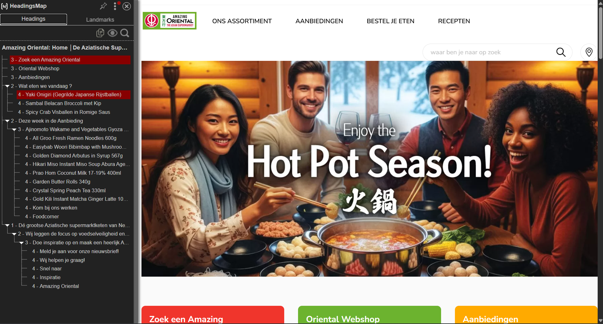
  Er is geen darkmode, veel divs met classes, weinig tab-focus.

## Breakdownschets (week 1)

  
uitwerken na afloop 3e werkgroep

  ### de hele pagina: 
  <!-- content img header + producten zijn sinds 19-11-2025 veranderd -->
  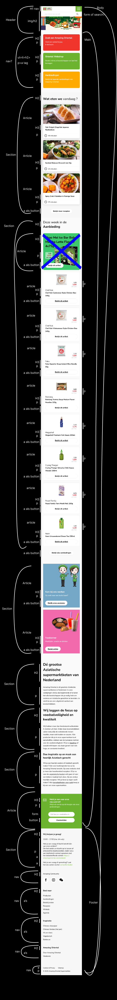

  ### dynamisch deel (bijv menu): 
  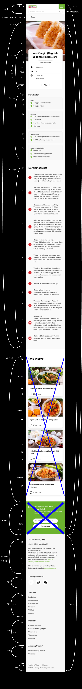

  ### wellicht nog een dynamisch deel (bijv filter): 
  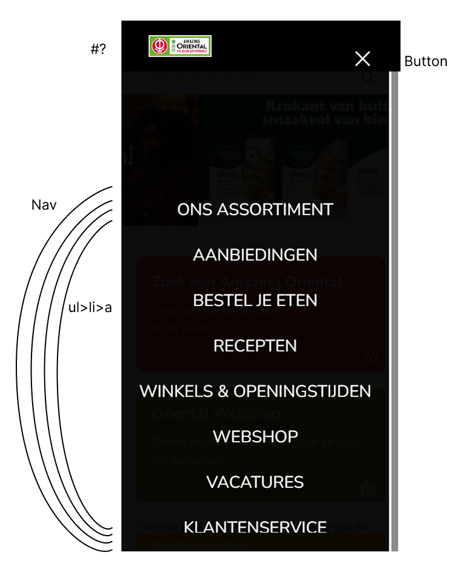

## Voortgang 1 (week 2)

  
uitwerken voor 1e voortgang

  ### Stand van zaken
  hier dit ging goed & dit was lastig (neem ook screenshots op van delen van je website en code)
  1 De breakdownschets duurde langer dan verwacht maar bracht veel steun om alle content daarna in html te zetten. Bij mijn eerste versie twijfelde ik soms of het een article was maar echter bleek het een link te zijn omdat het gehele blokje naar een andere pagina hoort te brengen.
  Het zou een article kunnen zijn met a voor het hele article of via nav>ul>li>a omdat het navigeert.
  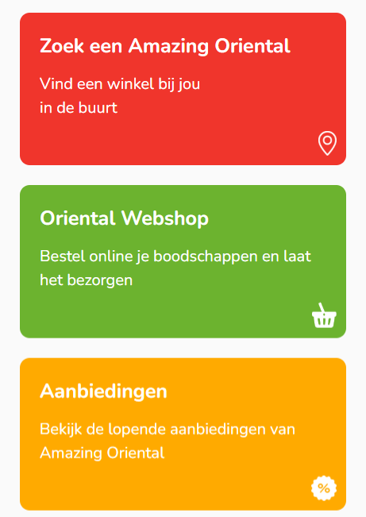

  2 In mijn eerste poging om alle tekstuele content in html te zetten lukte form niet helemaal
  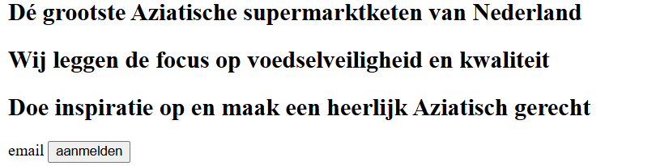

  3 In de tijd (19-11-2004) is de pagina veranderd aan afbeeldingen van de header en producten met tekst op de homepagina, ik had de vorige afbeeldingen nog niet gedownload dus moet deze opgezocht worden of mag het vervangen worden? Layout is hetzelde. (het antwoord was gewoon de nieuwe plaatjes gebruiken en de breakdownschets hoeft niet meer opnieuw)
  
  4 ik had tijdens mijn w3c validation een paar errors bij form action"" invullen en dat ik bij een section li als child had zonder ul als parent.
  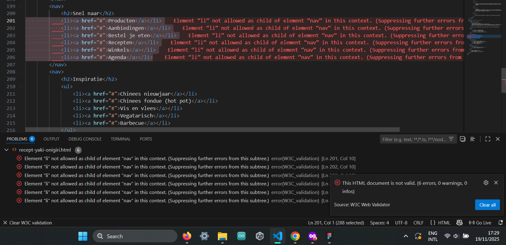

  5 tijdens de javascript les 20-11-2025 hebben we geleerd over een responsive hamburger menu (responsive fixed-button hamburger) vervolgens moest ik voor mijn website (responsive 2-buttons hamburger) uitvoeren, dit is gelukt https://codepen.io/DolanTea/pen/zxqExwQ.

  ### Agenda voor meeting
  samen met je groepje opstellen

  | Dylan
  | 

  | Stiene                                                    
  | omdraaien titel & rondddraaiend grid          |           
  | h2 en button & uit grid titel center          |                   

  | Nicha
  | aria-label active naar unactive               |
  | grid netjes maken                             |

  | Anne                                          |
  | een element en dropdown button disable state  |

  | Kasper                                        |
  | Responsive accordion footer starbucks         |

  ### Verslag van meeting
  hier na afloop snel de uitkomsten van de meeting vastleggen

  - | Stiene grid-column start en end oefenen h2 center plaatsen 
  - | Dylan | emmet cheat sheet  carousel klikbare afbeeldingen | list-style-type:"" voor de screenreader nog een lijst met list-style:none niet screenreader vriendelijk | @media(prefers-reduced-motion: no-prefrence)
  - : states :: dubbel over de content (voor firstletter etc.)
  - | Kasper footer details summary accordion menu maken voor mobiel responsive voor grotere devices
  - fonts in ::root is mooi maar mag font-face
  - 3 stylesheets css, 1 algemeen custom properties special states, 1 voor iedere pagina en javascript voor hamburger menu bijv

## Voortgang 2 (week 3)

  
uitwerken voor 2e voortgang

  ### Stand van zaken
  1 mijn carousel lukte niet met het selecteren van css selectoren, na met Damian studentassistente erachter gekomen dat ik te ver hebt geselecteerd, het was "ul" in mijn code "header>ul:first-of-type>li:first-child>a", na de uitleg "header > ul:nth-of-type(1)"
  2 oriental had veel font-face van nunito dit bleek te onnodig zijn omdat mijn pagina's niet de afwijken taal vietnamees/latijns heeft en kan ik veranderen in 5regels fontface ipv 400 ervan met allerlei verschillende font-weights.
  3 Hamburger menu met Sanne, via de codepen had ik geprobeerd de code toe te passen aan mijn code alleen dit lukte nog niet omdat via de media scaling de plaatsing van het lijstje aan a's op 2 verschillende styling komt te staan. Het is gelukt en begrepen om de bovenste 4 te krijgen en het hamburger menu open en dicht klappen. Alleen de 2de ul lijst nu tussen het logo en search krijgen is voor mij nog een mysterie ik hoorde er voldoende van te snappen volgens Sanne.
  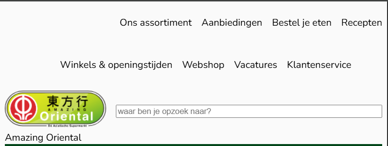
  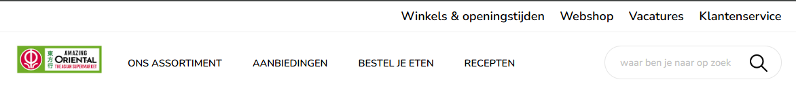
  4 Mijn header kreeg ik de 2'de ul lijst niet tussen het logo en de search. Dit is uiteindelijk wel gelukt na 2x hulp vragen via Sanne. Poging 1: bracht mij tot de screenshot die je nu ziet. Poging 2: geleerd dat het toch wel zat aan de order maar het was niet zelf gelukt op de juiste css selector aan te wijzen & de width:100%
  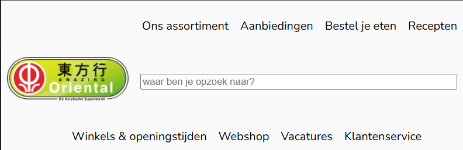

  ### Agenda voor meeting
  samen met je groepje opstellen

  | Dylan
  | grid kaartjes
  | afbeelding scaling

  | Stiene                                                    
  | grid is kapot  |           
  |                |                   

  | Nicha
  |                |
  |                |

  | Anne
  | Een ul zowel verticaal als horizontaal plaatsen |

  | Kasper
  | Afsnijden van svg door font-size |
  | SVG/Image in content zetten      |
  | Kaart in section                 |

  ### Verslag van meeting
  hier na afloop snel de uitkomsten van de meeting vastleggen

  - Stiene grid-column-start:-4 niet aangeraden maar moet justify-content:center zijn, custom properties voor font gebruiken 
  - Anne grid-template-area meer losse namen geven
  - Kasper Svg en titel in de footer wordt in een span gezet zodat je niet 2 elementen hebt maar wel de styling kan aanpassen via font-size wel aan sanne vragen voor pijltje svg want wat legaal is lastig te schatten voor de opdracht
  - Dylan gebruik voor al je iconen svgs. Om elementen horizontaal op dezelfde hoogte te krijgen kun je volgens damian een div gebruiken met flex en align content center
  - Nicha nintendo carousel ingewikkeld niet heel duidelijk wat legaal mag voor de opdracht 
- 

## Toegankelijkheidstest 2/2 (week 4)

  
uitwerken na test in 9e werkgroep

  ### Bevindingen
  Lijst met je bevindingen die in de test naar voren kwamen (geef ook aan wat er verbeterd is):

## Voortgang 3 (week 4)

  
uitwerken voor 3e voortgang

  ### Stand van zaken
  1 Oriental gebruikte afbeeldingen in png als iconen dit heb ik convert naar svg's
  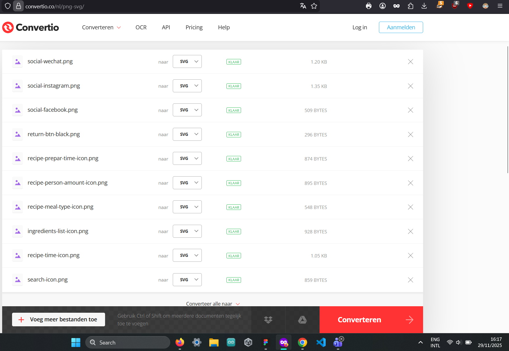
  2 ik had nog veel a-tags in mijn article maar dit moest andersom ook soms voor styling in de article. Het is a-tag>article>content met soms een div voor styling
  3 sommige iconen ook gedownload als svg komen niet te weergeven in codepen of als bestand, is wit maar via inspect krijg je wel de svg en path enz. ik ben verward.
  4 mijn grid kaartjes leken nog niet op hetzelfde van de website, dus ik heb de oefening 2 gridkaartjes opnieuw gedaan om meer ervan te begrijpen dit is nogal...vaag want ik zie die getallen niet echt voor mij voor de grids

  ### Agenda voor meeting
  samen met je groepje opstellen

  | student 1      | student 2          | student 3    | student 4        |
  | ---            | ---                | ---          | ---              |
  | dit bespreken  | en dit             | en ik dit    | en dan ik dat    |
  | en dat ook nog | dit als er tijd is | nog een punt | dit wil ik zeker |
  | ...            | ...                | ...          | ...              |

  ### Verslag van meeting
  hier na afloop snel de uitkomsten van de meeting vastleggen

  - punt 1
  - punt 2
  - nog een punt
  - ...

## Eindgesprek (week 5)

  
uitwerken voor eindgesprek

  ### Je uitkomst - karakteristiek screenshots:
  

  ### Dit ging goed/Heb ik geleerd: 
  Korte omschrijving met plaatjes

  

  ### Dit was lastig/Is niet gelukt:
  Korte omschrijving met plaatjes

  

## Bronnenlijst

  
continu bijhouden terwijl je werkt

  Nb. Wees specifiek ('css-tricks' als bron is bijv. niet specifiek genoeg). 
  Nb. ChatGpT en andere AI horen er ook bij.
  Nb. Vermeld de bronnen ook in je code.

  1. [bron 1] png naar svg via (https://convertio.co/nl/download/48d0a7c12c6d98b0e47de04de5fc94033c7342/)
  2. bron 2 alternative svg's (https://icons.getbootstrap.com/?q=mail)
  3. ...

